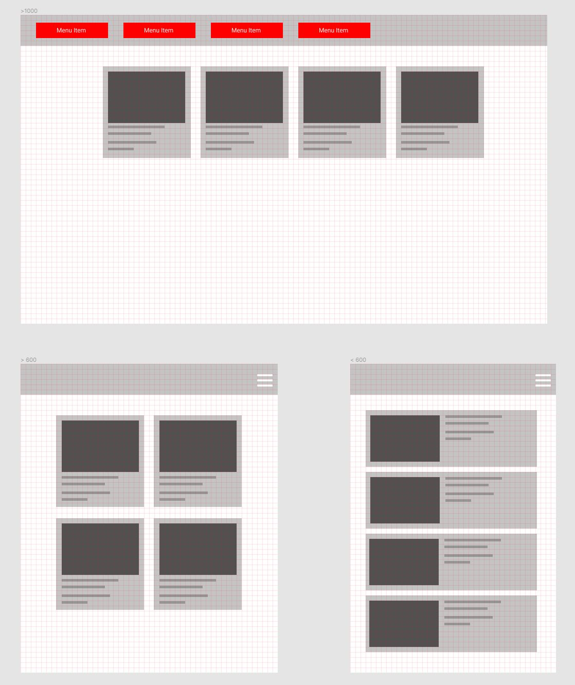

# T308-RWD

## -------INFO

```html
    <style>
        #container{
            background:red;
            display:flex;
            justify-content:space-around
        }
        .internal{
            min-width:100px;
            min-height:100px;
            margin:10px;
        }
        @media (max-width:600px) {
            #container{
                flex-direction:column;
            }
                       
        }
    </style>

......

    <div id="container">
        <div class="internal" id="pierwszy"></div>
        <div class="internal" id="drugi"></div>
        <div class="internal" id="trzeci"></div>
        <div class="internal" id="czwarty"></div>
    </div>
```

```
ZADT30801. Przygotuj stronę metodą RWD aby zachowywała się jak na poniższym obrazie:
- break points : 600px & 1000px
- dowolna metoda budowy layoutu
```




```
ZADT30802. Odtwórz stronę przedstawioną na poiniższym obrazie zgodnie z natępującymi założeniami:
- Strona zbudowana z navbara i czterech sekcji do których przenosi nawigacja z menu
- wysokość sekcji to 100% wysokości okna przeglądarki
- navbar ma wysokość 4em i zawiera logo, oraz menu poziome
- menu poziome znika i pojawia sięburger przy szerokości mniejszej niż 600px
- burger rozwija menu pionowe

aspekty dodatkowe (na wyższą ocenę)
- płynne przewijanie (scroll) do sekcji
- animowany burger
- akcja burgera uruchamiana przez click (a nie hover) 
```

[RWD_1](RWD_01.JPG) [RWD_2](RWD_02.JPG) 

[RWD_3](RWD_03.JPG) [RWD_4](RWD_04.JPG) 

### --------Links
https://github.com/T3iL/T303-CSS

GOOGLE DRIVE: https://drive.google.com/drive/folders/1OqTcjwr_qAdTPO-dThxUOd3ooTTOlzgp?usp=sharing

https://cdnjs.cloudflare.com/ajax/libs/font-awesome/4.7.0/css/font-awesome.min.css

https://www.htmlsymbols.xyz/games-symbols

https://www.w3.org | https://validator.w3.org | https://www.php.net/manual/en/
### --------Repositiories
https://www.w3schools.com | https://stackoverflow.com | https://css-tricks.com |
### --------On line editors
https://codepen.io/ | https://codesandbox.io/ | https://jsfiddle.net/ |
### ---------Assets
https://cdnjs.com/ | https://fontawesome.com | http://fontello.com/ | https://fonts.google.com/ | https://www.flaticon.com/
### ---------Stock Img
https://www.pexels.com/ | https://unsplash.com | https://pixabay.com
### ---------Tuts
https://www.youtube.com/watch?v=1Rs2ND1ryYc
https://www.youtube.com/watch?v=J35jug1uHzE
https://www.youtube.com/watch?v=ieTHC78giGQ
### ---------License
[MIT](https://choosealicense.com/licenses/mit/)
